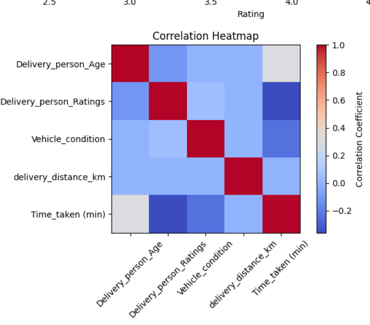
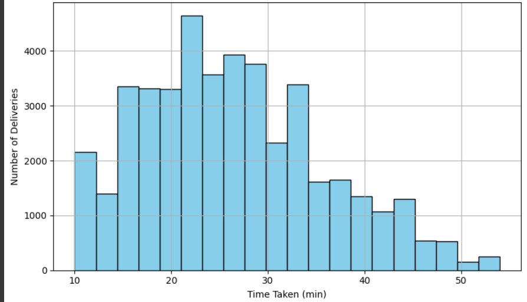
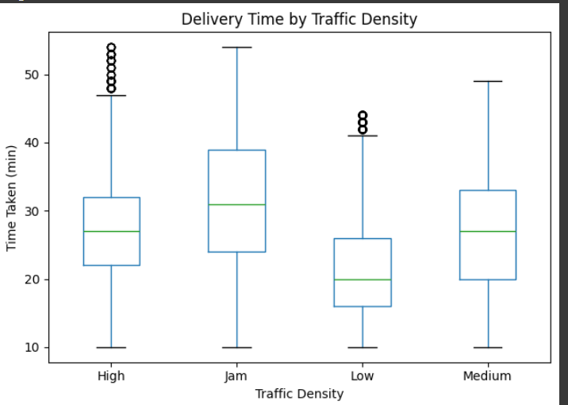
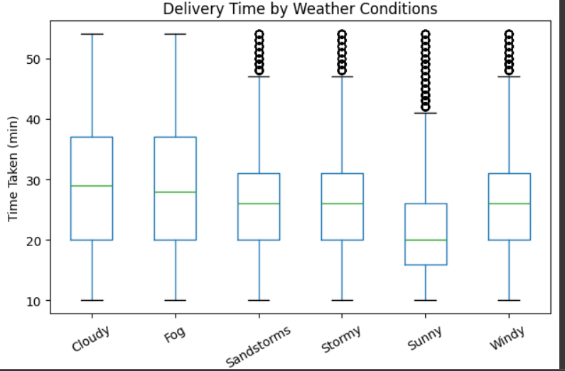
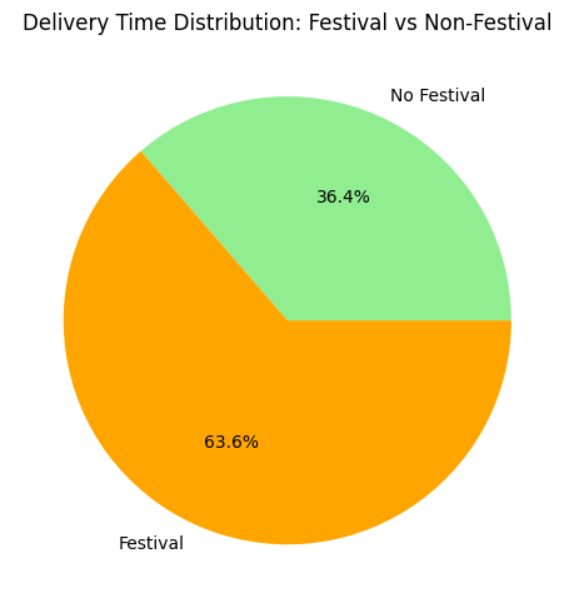

# 🛵 Swiggy Delivery Performance Optimization

A data-driven analysis of Swiggy’s delivery operations to identify bottlenecks in logistics and optimize delivery performance using real-world data.



## 📊 Overview

This project analyzes a real-world logistics dataset from Swiggy, with 20+ features including delivery times, rider ratings, weather, traffic, and vehicle conditions. It extracts actionable insights to enhance operational efficiency and reduce delays.

---


## 🚀 Key Objectives

- Identify primary factors causing delays (e.g., traffic, weather, rider efficiency).
- Engineer custom features like rush hour flags and delivery distance.
- Visualize trends and outliers using Matplotlib.
- Propose data-backed strategies to reduce delivery delays by ~15% during peak hours.
- Rank delivery partners based on average performance for incentive planning.

---

## 🛠️ Tech Stack

- **Language**: Python  
- **Libraries**: Pandas, NumPy, Matplotlib  
- **Environment**: Google Colab / Jupyter Notebook

---

## 📁 Files Included

- `swiggy_Delivery_Performance_Analysis.ipynb` – Complete Jupyter Notebook  
- `swiggy_insights.png` – Visualization used in this README

---

## 📌 Sample Insights

- 🚦 Peak traffic increases delivery time by up to 50%.  
- 🌧️ Adverse weather conditions strongly correlate with delays.  
- 🛵 Top-rated riders complete deliveries faster on average.

   

  

  
---


## 📎 How to Run

Clone the repository and open the notebook:
```bash
git clone https://github.com/yourusername/swiggy-delivery-analytics.git
